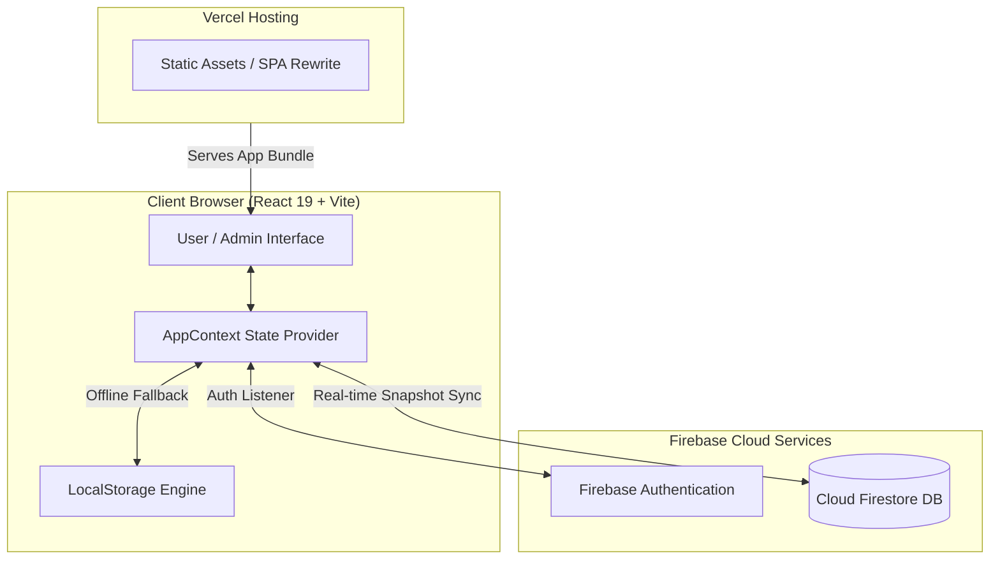
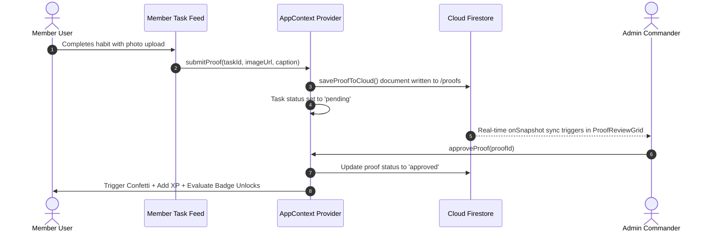

# NewYou - Gamified Routine Tracker & Admin Command Center


> **NewYou** is an open-source, full-stack gamified habit & routine tracking ecosystem. Built with **React 19**, **Vite**, **Tailwind CSS v4**, and **Firebase Firestore**, NewYou bridges personal discipline with real-time admin verification, photo proof submissions, dynamic badge generation, and customizable motivational personalities.

---

## 📑 Table of Contents

- [🌟 Platform Overview](#-platform-overview)
- [✨ Deep-Dive Features](#-deep-dive-features)
  - [🏋️‍♂️ Member Experience](#️-member-experience)
  - [🛡️ Admin Command Center](#️-admin-command-center)
  - [🏆 Dynamic Badges & XP Engine](#-dynamic-badges--xp-engine)
  - [💬 Multi-Personality Motivational System](#-multi-personality-motivational-system)
- [🏗️ System Architecture & Data Flow](#️-system-architecture--data-flow)
- [🛠️ Tech Stack & Dependencies](#️-tech-stack--dependencies)
- [💾 Database Schemas & API Contracts](#-database-schemas--api-contracts)
  - [Firestore Real-Time Collections](#firestore-real-time-collections)
  - [MongoDB / Express REST Contracts](#mongodb--express-rest-contracts)
- [🚀 Quickstart & Local Setup](#-quickstart--local-setup)
- [🌐 Production Deployment Guide](#-production-deployment-guide)
  - [Deploying on Vercel](#deploying-on-vercel)
  - [Firebase Firestore Security Rules](#firebase-firestore-security-rules)
- [📁 Complete Project Structure](#-complete-project-structure)
- [📄 License & Credits](#-license--credits)

---

## 🌟 Platform Overview

Traditional habit trackers rely strictly on self-reporting, leading to rapid drop-offs and lack of accountability. **NewYou** solves this by introducing:

1. **Visual Proof Verification**: Habits can require photographic evidence (e.g., gym photo, finished book page, step count screenshot).
2. **Admin Verification Loop**: System Admins evaluate pending proofs in real-time before XP and badge awards are finalized.
3. **Dynamic Specialized Badges**: When an admin creates a custom habit, the engine dynamically generates **4 specialized badge tiers** tied to that specific habit's completion count.
4. **Adaptive Tone Encouragement**: Encouragement popups dynamically adapt to individual user preferences (Discipline/Hardcore, Romantic, High Energy, or Zen).

---

## ✨ Deep-Dive Features

### 🏋️‍♂️ Member Experience

* **Interactive Task Feed**: Filter tasks by category (*Fitness*, *Nutrition*, *Mindfulness*, *Growth*, *Hydration*, *Custom*).
* **Dual Execution Modes**:
  * *Standard Checkbox*: Single-click completion with instant XP award.
  * *Numeric Target Tracker*: Increment progress numerically (e.g., `7,500 / 10,000 steps`) with dynamic progress bars.
* **Photo Proof Modal**: Integrated file picker or image URL input with optional user captions.
* **Live Streak & Momentum Engine**: Daily streak counter that detects consecutive active days, calculates highest streaks, and triggers confetti explosions on milestones.
* **Insights & Progress Rings**: Visual SVG progress rings computing completion percentages across daily routine categories.

### 🛡️ Admin Command Center

* **Proof Review Grid**: Live queue displaying user submitted photo evidence with options to **Approve** (awards XP & unlocks badges) or **Reject** (with custom rejection feedback).
* **Habit & Specialized Badge Creator**:
  * Define habit title, category, target value, unit, difficulty tier (*Easy*, *Medium*, *Hard*, *Extreme*), and assignment target (*All Members* or specific user).
  * Automatically generates **4 live specialized badges**: *Initiate (1x)*, *Specialist (10x)*, *Hardcore Titan (50x)*, and *100x Sovereign (100x)*.
* **Motivational Tone Manager**:
  * Set the global default motivational category.
  * Override and assign custom motivational personalities to individual member handles/emails.
* **System Operations Overview**: Real-time operational metrics including total active users, pending verifications, today's approvals, and system uptime.

### 🏆 Dynamic Badges & XP Engine

#### XP Progression Architecture (8 Tiers)
| Level | Rank Title | Required XP Range |
| :---: | :--- | :---: |
| **Level 1** | Novice Initiated | `0 - 249 XP` |
| **Level 2** | Consistent Tracker | `250 - 599 XP` |
| **Level 3** | Momentum Builder | `600 - 1,099 XP` |
| **Level 4** | Habit Warrior | `1,100 - 1,799 XP` |
| **Level 5** | Routine Master | `1,800 - 2,699 XP` |
| **Level 6** | Iron Disciplinarian | `2,700 - 3,799 XP` |
| **Level 7** | Elite Operator | `3,800 - 4,999 XP` |
| **Level 8** | Legend of NewYou | `5,000+ XP` |

#### Badge System Design
Includes **30+ Core Badges** categorized into 5 Rarity Tiers (*Common*, *Rare*, *Epic*, *Legendary*, *Mythic*) across:
- **Progression**: Unlocked upon reaching specific XP levels.
- **Streak**: Unlocked at 3, 7, 30, 100, and 365 days of continuous active habits.
- **Achievements**: Unlocked at 1, 10, 50, 100, 250, and 500 completed habits.
- **Steps Milestones**: Awarded for completing 5k, 10k, 12k, 20k, and 50k step goals.
- **Verification Proofs**: Unlocked at 1, 25, 100, 250, and 500 approved photo proofs.
- **Specialized Tasks**: Auto-generated 4-tier milestone badges created per custom task.

---

### 💬 Multi-Personality Motivational System

The motivational popup system personalizes encouragement strings using dynamic template tags (`{name}`, `{streak}`):

```javascript
// Sample Motivational Category Configurations
{
  hard: {
    title: "Hard On-Point (Discipline)",
    icon: "🔥",
    template: "No excuses, {name}. You proved your discipline today. Unyielding focus. {streak} Days Strong."
  },
  romantic: {
    title: "Romantic & Affirming",
    icon: "💖",
    template: "You are rendering so brightly today, my love! {streak} days of pure magic! 💕"
  },
  hype: {
    title: "High Energy & Hype",
    icon: "⚡",
    template: "ABSOLUTE LEGEND ALERT! {name} just destroyed today's targets! Unstoppable momentum on day {streak}! 🚀⚡"
  },
  zen: {
    title: "Zen & Mindful Wisdom",
    icon: "🧘",
    template: "Peaceful consistency, {name}. One breath, one step at a time. Honor your quiet strength today."
  }
}
```

---

## 🏗️ System Architecture & Data Flow



### Proof Approval Data Flow



---

## 🛠️ Tech Stack & Dependencies

### Frontend Libraries
- **React 19** (`^19.2.8`): Framework for component state and DOM rendering.
- **Vite** (`^8.2.0`): Lightning-fast build tool and dev server.
- **Tailwind CSS v4** (`^4.3.3`): Utility-first CSS engine with PostCSS processing.
- **Lucide React** (`^1.28.0`): Clean vector icons.
- **Canvas Confetti** (`^1.9.4`): Particle explosion animations on achievements.

### Backend & Database
- **Firebase SDK** (`^12.17.0`): Modular Authentication & Firestore database integration.

### Code Quality & Utilities
- **Oxlint** (`^1.75.0`): High-performance JavaScript/JSX linter.

---

## 💾 Database Schemas & API Contracts

### Firestore Real-Time Collections

#### `/users/{uid}` Document
```json
{
  "name": "Member User",
  "email": "user@example.com",
  "handle": "@member",
  "role": "user",
  "xp": 1420,
  "level": 4,
  "streak": 12,
  "highestStreak": 15,
  "updatedAt": "2026-08-04T00:00:00.000Z"
}
```

#### `/users/{uid}/tasks/{taskId}` Document
```json
{
  "id": "task-1725000000000",
  "title": "Morning 10k Run",
  "category": "Fitness",
  "difficulty": "Hard",
  "points": 200,
  "requiresProof": true,
  "completed": false,
  "currentValue": 7500,
  "targetValue": 10000,
  "unit": "steps",
  "proofStatus": "pending",
  "proofUrl": "https://example.com/proof.jpg"
}
```

#### `/proofs/{proofId}` Document
```json
{
  "id": "proof-1725000000000",
  "taskId": "task-1725000000000",
  "taskTitle": "Morning 10k Run",
  "userName": "Member User",
  "userEmail": "user@example.com",
  "imageUrl": "https://example.com/proof.jpg",
  "caption": "Pushed through 10k morning run!",
  "status": "pending",
  "submittedAt": "Just now",
  "updatedAt": "2026-08-04T00:00:00.000Z"
}
```

---

### MongoDB / Express REST Contracts

If connecting to a custom Node.js / Express backend instead of Firebase, standard schemas are included in [`src/services/dbService.js`](file:///c:/Users/phhav/OneDrive/Desktop/NewYou/src/services/dbService.js#L120-L156):

```javascript
// TaskSchema.js (Mongoose Schema)
const TaskSchema = new mongoose.Schema({
  userId: { type: String, required: true },
  title: { type: String, required: true },
  category: String,
  requiresProof: Boolean,
  completed: Boolean,
  currentValue: Number,
  targetValue: Number,
  unit: String,
  points: Number,
  createdAt: { type: Date, default: Date.now }
});

// REST API Endpoints
// GET    /api/tasks/:userId  -> Fetch user custom tasks
// POST   /api/tasks          -> Create new habit task
// DELETE /api/tasks/:taskId  -> Delete habit task
// POST   /api/proofs         -> Submit media proof
// PUT    /api/admin/tone     -> Update motivational category tone
```

---

## 🚀 Quickstart & Local Setup

### 1. Clone & Install
```bash
# Clone the repository
git clone https://github.com/PANTH2517/NewYou.git
cd NewYou

# Install dependencies
npm install
```

### 2. Configure Environment Variables
Create a `.env` file in the project root:
```env
VITE_FIREBASE_API_KEY=your_firebase_api_key
VITE_FIREBASE_AUTH_DOMAIN=your_project.firebaseapp.com
VITE_FIREBASE_PROJECT_ID=your_project_id
VITE_FIREBASE_STORAGE_BUCKET=your_project.firebasestorage.app
VITE_FIREBASE_MESSAGING_SENDER_ID=your_sender_id
VITE_FIREBASE_APP_ID=your_app_id

# Designated Admin Authorization Email Guard
VITE_ADMIN_EMAIL=admin@newyou.com
```

### 3. Launch Development Server
```bash
npm run dev
```
Navigate to `http://localhost:5173`.

### 4. Code Linting & Build
```bash
# Run oxlint
npm run lint

# Build production distribution
npm run build
```

---

## 🌐 Production Deployment Guide

### Deploying on Vercel

1. Push your latest code to GitHub:
   ```bash
   git add .
   git commit -m "Deploy NewYou app"
   git push origin main
   ```
2. Go to **[vercel.com/new](https://vercel.com/new)** and import `PANTH2517/NewYou`.
3. In project settings, add the `.env` variables under **Environment Variables**.
4. Click **Deploy**.

The included [`vercel.json`](file:///c:/Users/phhav/OneDrive/Desktop/NewYou/vercel.json) file guarantees SPA route rewrites:
```json
{
  "rewrites": [
    {
      "source": "/(.*)",
      "destination": "/index.html"
    }
  ]
}
```

---

### Firebase Firestore Security Rules

Copy these rules into your Firebase Console under **Firestore Database -> Rules**:

```javascript
rules_version = '2';
service cloud.firestore {
  match /databases/{database}/documents {
    
    // User profile and sub-collections
    match /users/{userId} {
      allow read, write: if request.auth != null && request.auth.uid == userId;
      
      match /tasks/{taskId} {
        allow read, write: if request.auth != null && request.auth.uid == userId;
      }
      match /data/{docId} {
        allow read, write: if request.auth != null && request.auth.uid == userId;
      }
    }

    // Proofs submitted for review
    match /proofs/{proofId} {
      allow read, create: if request.auth != null;
      allow update, delete: if request.auth != null && request.auth.token.email == 'admin@newyou.com';
    }

    // Global admin system configuration
    match /system/{document=**} {
      allow read: if request.auth != null;
      allow write: if request.auth != null && request.auth.token.email == 'admin@newyou.com';
    }
  }
}
```

---

## 📁 Complete Project Structure

```text
NewYou/
├── public/                     # Static assets & favicons
│   ├── favicon.svg
│   └── icons.svg
├── src/
│   ├── assets/                 # App graphics & SVGs
│   ├── components/
│   │   ├── AdminView/
│   │   │   ├── MotivationalManager.jsx  # Tone manager & user tone override assignment
│   │   │   ├── ProofReviewGrid.jsx      # Pending proof review grid (Approve/Reject)
│   │   │   ├── TaskManager.jsx          # Habit creator & dynamic badge generator
│   │   │   └── UserOverview.jsx         # System ops analytics & user streaks list
│   │   ├── Common/
│   │   │   ├── TiltCard.jsx             # Interactive 3D card tilt wrapper
│   │   │   └── UserAvatar.jsx           # Fallback avatar renderer
│   │   ├── UserView/
│   │   │   ├── BadgesGrid.jsx           # Rarity badge showcase & live progress modal
│   │   │   ├── InsightsRings.jsx        # SVG category completion progress rings
│   │   │   ├── ProofUploadModal.jsx     # Photo/image proof submission modal
│   │   │   ├── StreakBanner.jsx         # Dynamic streak counter & XP progress bar
│   │   │   ├── StreakMessageModal.jsx   # Interactive motivational popup modal
│   │   │   └── TaskFeed.jsx             # Category filtering & task checklist
│   │   ├── AuthModal.jsx       # Firebase Google OAuth & Email login modal
│   │   ├── Navbar.jsx          # Header bar with user profile & role switcher
│   │   └── Sidebar.jsx         # Main navigation menu
│   ├── context/
│   │   └── AppContext.jsx      # Global React Context, XP calculation & badge evaluator
│   ├── services/
│   │   └── dbService.js        # Firestore sync methods & MongoDB API contract reference
│   ├── App.css                 # Custom glassmorphism & animation keyframes
│   ├── App.jsx                 # App layout router & tab view switcher
│   ├── constants.js            # XP levels, 30+ core badges, motivational categories
│   ├── firebase.js             # Firebase initialized app & auth helpers
│   ├── index.css               # Tailwind CSS imports & global design tokens
│   ├── main.jsx                # React root entry point
│   └── mockData.js             # Initial state defaults & XP mappings
├── .env.example                # Template for environment configuration
├── .gitignore                  # Git ignore rules (node_modules, dist, .env)
├── .oxlintrc.json              # Oxlint lint configuration
├── index.html                  # Main HTML entry document
├── package.json                # Scripts & package manifest
├── postcss.config.js           # PostCSS configuration
├── tailwind.config.js          # Tailwind CSS theme extensions
├── vercel.json                 # Vercel SPA rewrite configuration
└── vite.config.js              # Vite bundler plugins & settings
```

---

## 📄 License & Credits

- Designed & developed for personal growth and routine accountability.
- Released under the **MIT License**.
- Developed with support from **Antigravity AI**.
